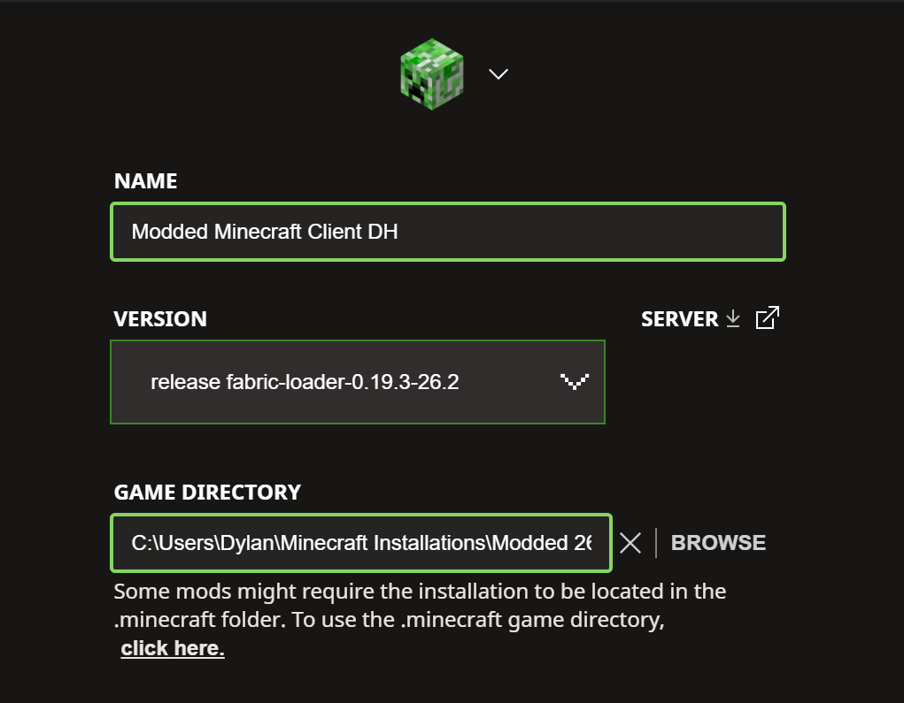
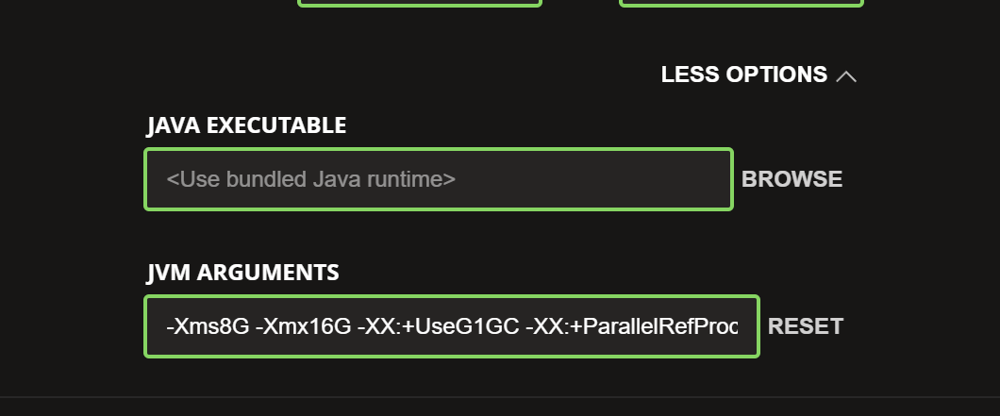

# Modded Survival 26.2 Setup Guide

This guide explains how to install the Fabric 26.2 client pack in its own game directory, set a sensible memory limit, and join the private Modded Survival server.

> [!IMPORTANT]
> Download exactly one client ZIP from the [Fabric 26.2 Stable release](https://github.com/Dweaver425/modded-survival-26-2-setup/releases/tag/v26.2-stable). Expand **Assets** and ignore GitHub's automatically generated source-code archives. The Minecraft world, account files, and server backups are not included.

## Downloads

The release contains all six client choices, the active server pack, optional shader and resource-pack libraries, and `SHA256SUMS.txt` for download verification. Friends must be invited to this private GitHub repository before the release page will open for them.

## Credits And Ownership

This is a community modpack assembled, configured, tested, and documented by Dylan Weaver (Minecraft username: Stixity). The mods, libraries, shaders, resource packs, Fabric Loader, and Minecraft remain the work and property of their respective creators; Dylan does not claim authorship of those projects.

Dylan's only original mod component is `indium-server-dummy.jar`, a metadata-only dedicated-server compatibility shim with no executable classes or third-party code. It helps the coordinated server/client distribution support Voxy Server for Dylan's Voxy client and Distant Horizons clients for friends; Voxy, Voxy Server, Distant Horizons, and Indium are still independent third-party projects.

See the [complete third-party credits and license ledger](CREDITS.md) for every distributed file, including its creator, version, source, license, and the packs that contain it. Credits supplement rather than replace each project's license terms.

## Server

- **Minecraft:** Java Edition 26.2
- **Loader:** Fabric Loader 0.19.3
- **Server name:** Modded Survival
- **Server address:** `katherine-thorough.tun.ply.gg`
- **Port:** Do not add one. The Playit address selects the correct public port.
- **Access:** Your exact Minecraft Java username must be on the whitelist.

Use **Multiplayer > Add Server** so the address is saved. Direct Connection also works.

## 1. Choose A Client Pack

Use exactly one pack. Do not combine the Voxy and Distant Horizons client mods in the same installation.

| Pack | Best for | Recommended RAM |
| --- | --- | ---: |
| Windows Max - Voxy | Dylan's high-end Windows PC, maximum distance rendering and shaders | **12 GB** |
| Windows - Distant Horizons | Windows PCs that want long-distance LOD rendering | **8 GB** |
| Windows - No LOD | Stable general-purpose Windows setup | **6 GB** |
| Mac - Distant Horizons | Apple Silicon Mac with at least 16 GB unified memory | **6 GB** |
| Mac - No LOD | Recommended Mac setup and safest Mac option | **5 GB** |
| Universal - Extreme Low End | Older PCs, low-memory systems, or troubleshooting | **3-4 GB** |

The server supports both Voxy and Distant Horizons clients. Each client still chooses only one LOD system. Voxy is not included in the Mac packs.

See [RAM Guide](docs/RAM-GUIDE.md) before using a different value.

Optional shaders and resource packs are included in the client ZIPs but disabled by default. See the [Visuals Guide](docs/VISUALS-GUIDE.md) before enabling them.

## 2. Extract The Pack Outside `.minecraft`

Create a new, empty folder for the selected pack and extract the entire ZIP into that folder. Do not place the ZIP in a `mods` folder, do not extract it over `.minecraft`, and do not copy the pack's files into `.minecraft`.

> [!WARNING]
> Leave the normal `.minecraft` folder unchanged. Every modded client pack must have its own separate game directory.

### Windows

1. Create a folder such as:

   ```text
   C:\Users\YOUR_NAME\Minecraft Installations\Modded Survival 26.2 - PACK NAME
   ```

2. Right-click the downloaded client ZIP and select **Extract All**.
3. Choose the new folder above as the extraction destination.
4. Open that folder and confirm that you immediately see `mods`, `config`, and the installation README.

### macOS

1. In your home folder, create:

   ```text
   ~/Minecraft Installations/Modded Survival 26.2 - PACK NAME
   ```

2. Double-click the downloaded client ZIP to extract it.
3. Move the extracted contents into the new folder above, not into `~/Library/Application Support/minecraft`.
4. Confirm that `mods` and `config` are directly inside the selected folder.

If you see another identically named folder before reaching `mods`, select the inner folder as the game directory.

## 3. Register Fabric In Minecraft Launcher

Fabric is registered with the normal Minecraft Launcher, but the modpack files remain in the separate folder created above.

1. Close Minecraft and Minecraft Launcher.
2. Open the pack's `installer` folder.
3. Run the included Fabric installer.
4. Select **Client**.
5. Select Minecraft `26.2` and Fabric Loader `0.19.3`.
6. Leave the install location set to the normal Minecraft location.
7. Select **Install**.

If `fabric-loader-0.19.3-26.2` already appears in Minecraft Launcher, you may skip this section.

## 4. Create A Separate Launcher Installation

1. Open **Minecraft Launcher**.
2. Select **Minecraft: Java Edition > Installations**.
3. Select **New installation**.
4. Change **Name** to a clear label matching the downloaded pack, such as `Modded Survival 26.2 - Voxy` or `Modded Minecraft Client DH`.
5. Under **Version**, choose:

   ```text
   release fabric-loader-0.19.3-26.2
   ```

6. Change **Game Directory** to the new extracted pack folder that directly contains `mods` and `config`.
7. Leave **Java Executable** set to `<Use bundled Java runtime>`.
8. Do not use the default `.minecraft` directory for this installation.



The path in the screenshot is an example from Dylan's PC. Each player must browse to the new folder they created on their own computer. Ignore the launcher's suggestion that some mods might require `.minecraft`; do not select **click here** for this pack.

On macOS, press `Command + Shift + G` in the folder picker if you need to enter the game-directory path manually.

## 5. Set The RAM Limit

1. While editing the launcher installation, open **More Options**.
2. Find the JVM argument beginning with `-Xmx`.
3. Change only that value to the recommendation for your pack.
4. Leave **Java Executable** on the bundled Java runtime and leave the remaining JVM arguments unchanged.

Examples:

```text
-Xmx12G
-Xmx8G
-Xmx6G
-Xmx4G
```

For the Windows Max Voxy pack, use `-Xmx12G`. Do not give every pack 12 GB. More memory is not automatically faster, and allocating too much can leave too little for the operating system, shaders, Distant Horizons, or Voxy's native memory.



The screenshot shows Dylan's high-memory example with `-Xms8G -Xmx16G`. Friends should not copy the entire line. Change only the existing `-Xmx` value to the recommendation in the pack table, do not add a second `-Xmx`, and do not delete the remaining launcher arguments.

## 6. Save And Test The Installation

1. Select **Create** or **Save**.
2. Return to the **Play** tab.
3. Select the new Fabric installation, not Latest Release.
4. Launch the game.
5. Confirm that the title screen identifies Fabric and that the **Mods** menu is available.

The first launch can take longer while configuration and cache folders are created.

## 7. Join The Server

1. Select **Multiplayer**.
2. Select **Add Server**.
3. Enter:

   ```text
   Server Name: Modded Survival
   Server Address: katherine-thorough.tun.ply.gg
   ```

4. Select **Done**, then join the server.

The server PC and Playit agent must be running. You cannot connect from two computers at the same time using the same Minecraft account.

## Server Backups

The server host uses FastBack snapshot backups stored on a separate physical drive. Client players do not need to configure backups. The world, snapshots, private drive paths, and account data are intentionally excluded from this repository.

## Quick Troubleshooting

| Message or symptom | Most likely cause |
| --- | --- |
| Mods do not appear | The launcher is using the wrong Game Directory or the ZIP was not extracted |
| Incompatible mods | Wrong pack, wrong Minecraft version, or the pack was manually mixed with another pack |
| Not whitelisted | Send Dylan your exact Minecraft Java username |
| Connection timed out | The server or Playit agent is offline, or the server is busy starting |
| Voxy error on Mac | Use Mac No LOD or Mac Distant Horizons instead |
| Game runs out of memory | Increase `-Xmx` within the safe range in the RAM guide |
| Broken mob eyes or textures | Disable either Faithful 32x or Fresh Animations; they need a matching compatibility patch |
| LOD terrain ignores the shader | Use Photon on Windows Voxy/DH, or disable the shader |

See [Troubleshooting](docs/TROUBLESHOOTING.md) for detailed checks.
